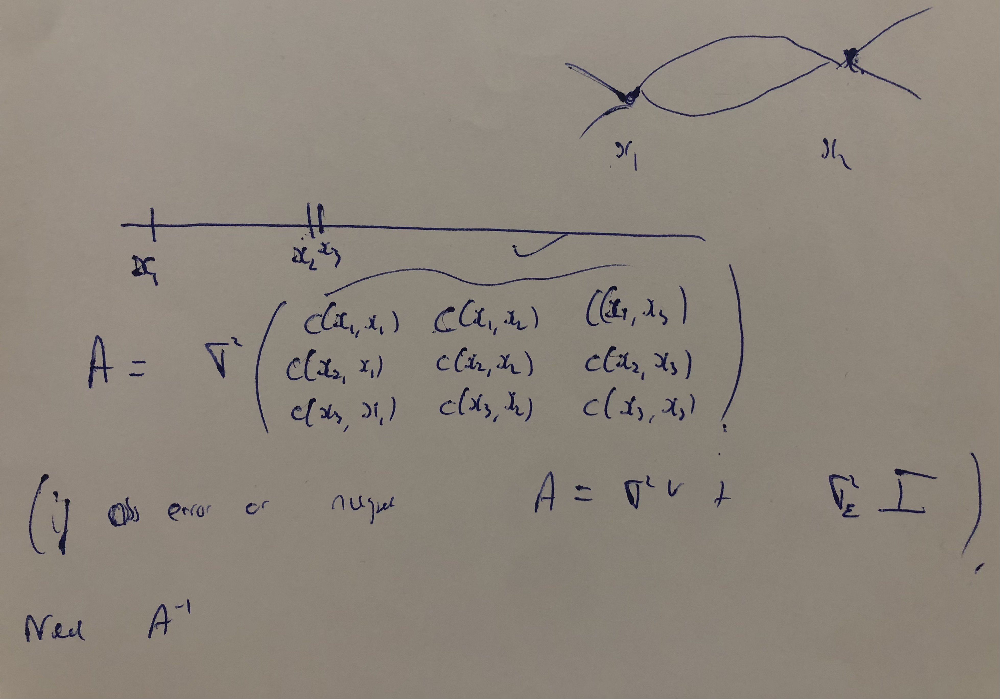

# Premise

This example comes from @brynjarsdottir14. It is intended to demonstrate the importance of incorporating model discrepancy when attempting to learn about model parameters through calibration.

A real-life process is given by the equation
\begin{equation}
\zeta(x) = \frac{\theta x}{1 + \frac{x}{a}},
\end{equation}

```{r real life process parameters, include=F}
efficiency <- 0.65
a <- 20
```

with $\theta=$ `r efficiency` and $a=$ `r a`, and $x$ a one-dimensional *control input*.

# Parameter estimation using observations (calibration)

In attempting to model the real life process given in Equation (\textcolor{red}{1}), we build a simulator, denoted $\eta(x, \theta)$, of the form
\begin{equation}
\eta(x_i, \theta) = \theta x_i.
\end{equation}

```{r, model-versus-rl-process, fig.height = 3.5, echo=F, fig.cap="The real-life process and our simulator for it, plotted over control inputs from 0.00 to 6.00.", fig.align='center', out.width="60%"}
plot(c(0,6), c(0,4),
     xlab = "X (Effort)", ylab = "Work",
     cex=1.1, cex.lab=1.1, cex.axis=1.1,
     col = "white")
abline(0, 0.65, col="darkgreen", lwd=2)
curve((efficiency * x) / (1 + x / a), col="magenta", add = TRUE, lwd = 2, lty=2)
legend(0, 4,
       c(
         expression(paste("Simple Machine ", eta, "(x,0.65) ")),
         expression(paste("True process ", zeta, "(x) "))
         ),
       col = c("darkgreen", "magenta"),
       cex = c(1.1,1.1),
       lwd = c(2,2), lty = c(1,2),pch = c(NA,NA))

# plot_function(control_inputs_s, obs_errors_s, obs_s)
# plot_function(control_inputs_m, obs_errors_m, obs_m)
# plot_function(control_inputs_l, obs_errors_l, obs_l)
```

This model, with $\hat{\theta}$ set equal to the true value of $\theta$, is plotted alongside the equation representing the real-life process in Figure 1. A word on this straight-line model: Figure 1 shows us that in order for this model (green) to fit well any data produced by the real-life process (pink), the estimated value of $\theta$, which corresponds to the gradient of the green line would need to be lower that the true value of $0.65$.

```{r, include=F}
n_s <- 11
n_m <- 31
n_l <- 61
```

Usually we would take observations of the real-life process $\zeta(x)$ in order to allow us to estimate $\theta$, but in this demonstrative example we simulate observations instead. We simulate three samples of observations at, respectively, `r n_s`, `r n_m` and `r n_l` values of $x$ spaced evenly over the interval $[0.2,4]$. When taking measurements in practice, you will incur a measurement error, and for each of our $n$ simulated observations we generate a measurement error $\epsilon$ from a $N(0, 0.01^2)$ distribution and add this on. In other words, the $i$th observation, $z_i$, $i=1,\dots,n$, is generated by
$$z_i = \frac{0.65 x_i}{1 + \frac{x_i}{20}} + \epsilon_i, \hspace{1cm} \epsilon_i \sim N(0, 0.01^2).$$

```{r samples simulation, include=F}
var_meas_err <- 0.01
sample_sim <- function(n, size) {
  x <- matrix(seq(0.2,4,(4-(0.2))/(n-1)), ncol = 1)
  assign(paste0("control_inputs_", size), 
         x, 
         envir = .GlobalEnv)
  e <- matrix(rnorm(n,0,var_meas_err), ncol=1)
  assign(paste0("obs_errors_", size), 
         e, 
         envir = .GlobalEnv)
  zeta <- (efficiency * x) / (1 + x / a)
  z <- as.matrix(zeta, ncol=1) + e
  assign(paste0("obs_", size), 
         z, 
         envir = .GlobalEnv)
}
sample_sim(n_s, "s")
sample_sim(n_m, "m")
sample_sim(n_l, "l")
```

The observations produced are shown in Figure 2.

```{r, figures-side, fig.show="hold", out.width="33%", fig.height = 8, echo=F, fig.cap="The three samples of observations, of sizes 11, 31 and 61.", warning=F}
plot_function <- function(control_inputs, obs_errors, obs) {
  plot(obs ~ control_inputs, lwd=2, col="blue", xlim=c(0,4.2), ylim=c(0,2.4),
     xlab = "X (Effort)", ylab = "Work", cex=1.10, cex.lab=2, cex.axis=2)
curve((efficiency * x) / (1 + x / a), col="magenta", add = TRUE, lwd = 2, lty=2)
points(obs ~ control_inputs, lwd=2, col="blue", xlim=c(0,6), ylim=c(0,4), cex=1.10)
legend(0, 2.4,
       c(
         expression(paste("True process ", zeta, "(x) ")),
         "Observations"),
       col = c("magenta","blue"),
       cex = c(2,2),
       lwd = c(2,2), lty = c(2,0),pch = c(NA,1))
}

plot_function(control_inputs_s, obs_errors_s, obs_s)
plot_function(control_inputs_m, obs_errors_m, obs_m)
plot_function(control_inputs_l, obs_errors_l, obs_l)
```

We now attempt calibration using the observations to estimate the unknown parameter $\theta$, first without considering model discrepancy and secondly with.

## Not incorporating model discrepancy

By not taking into account model discrepancy, we are assuming that $\eta = \zeta$, in essence that our model is correct and that the only error involved is the measurement error. Thus we assume that the $i$th observation, $z_i$, is generated by
$$z_i = \theta x_i + \epsilon_i, \hspace{1cm} i=1, \dots, n,$$
with $\epsilon_i \sim N(0, \sigma_e^2)$, $\sigma_e^2$ unknown. Therefore,
$$z_i \: | \: \theta, \sigma_e^2 \sim N(\theta x_i, \sigma_e^2)$$
(where $\theta$ and $\sigma_e^2$ need to be stated 'given', since these are treated as random / unknown, but the $x_i$s don't need such a statement, since we're not assuming these to be treated as random, and are instead known/set from the outset), and the likelihood for the data is
\begin{align}
\mathcal{L}(\theta, \sigma_e^2 \: | \: \textbf{z})    &= \prod_{i=1}^n z_i \nonumber \\
                                              &= \prod_{i=1}^n \frac{1}{\sqrt{2\pi} \sigma_e} \text{exp} \left\{ - \frac{1}{2 \sigma_e^2} \left( z_i - \theta x_i \right)^2 \right\} \nonumber \\
                                              &\propto \frac{1}{\sigma_e} \text{exp} \left\{ - \frac{1}{2 \sigma_e^2} \sum_{i=1}^n \left( z_i - \theta x_i \right)^2 \right\}.
\end{align}

A joint improper prior for $\theta$ and $\sigma_{\epsilon}^2$ of $p(\theta, \sigma_{\epsilon}^2) \propto \sigma_{\epsilon}^{-2}$ results in the analytically-derivable (marginal) posterior for $\theta$
\begin{align}
\text{St}_{n-p-1}\left(\theta \: \middle| \: \hat{\theta} = (\textbf{x}^T\textbf{x})^{-1} \textbf{x}^{T} \textbf{z},
                              \: S^2 = \frac{1}{n - p - 1} \frac{(\textbf{z} - \textbf{x} \hat{\theta})^T (\textbf{z} - \textbf{x} \hat{\theta})} {(\textbf{x}^T \textbf{x})}, 
                              \: \nu = n-p-1\right)
\end{align}

where \textbf{x} and \textbf{z} are column vectors of length $n$ containing, respectively, the control inputs and simulated observations, and $p=0$. For the three different samples, posterior distributions^[See [https://stats.stackexchange.com/questions/567944/how-can-i-sample-from-a-shifted-and-scaled-student-t-distribution-with-a-specifi](https://stats.stackexchange.com/questions/567944/how-can-i-sample-from-a-shifted-and-scaled-student-t-distribution-with-a-specifi).] are shown in Figure 3(a).

```{r posterior, include=F}
p <- 0
x_0_int <- 1.5
x_0_ext <- 6

post_pars <- function(n, control_inputs, obs, size) {
  m <- as.vector(1/(t(control_inputs) %*% control_inputs)) * t(control_inputs) %*% obs
  assign(paste0("mean_", size), 
         m, 
         envir = .GlobalEnv)
  v <- 1/(n - p - 1) * (t(obs - control_inputs * as.vector(m)) %*% (obs - control_inputs * as.vector(m))) / (t(control_inputs) %*% control_inputs)
  assign(paste0("var_", size), 
         v, 
         envir = .GlobalEnv)
  s <- sqrt(v)
  assign(paste0("st_dev_", size), 
         s, 
         envir = .GlobalEnv)
  draws <- as.vector(m) + as.vector(sqrt(v) * sqrt((n-p-1-2)/(n-p-1))) * rt(1000000, n-2-1)
  assign(paste0("post_draws_", size), 
         draws, 
         envir = .GlobalEnv)
  assign(paste0("cred_ints_", size), 
         round(quantile(draws, c(0.05, 0.95)),3), 
         envir = .GlobalEnv)
  assign(paste0("post_interpolations_", size), 
         draws * x_0_int, 
         envir = .GlobalEnv)
  assign(paste0("post_extrapolations_", size), 
         draws * x_0_ext, 
         envir = .GlobalEnv)
}

post_pars(n_s, control_inputs_s, obs_s, "s")
post_pars(n_m, control_inputs_m, obs_m, "m")
post_pars(n_l, control_inputs_l, obs_l, "l")
```

```{r, warning=F, include=F}
library(gridExtra)
library(grid)
```

```{r posts-no-md, fig.cap="Posterior densities, for each of the three samples, of: (a) $\\theta$, (b) $\\zeta (1.5)$ (interpolation with the simulator), and (c) $\\zeta (6)$ (extrapolation). True values are indicated by vertical lines.", fig.subcap= c("","",""), out.width = '.33\\linewidth', fig.height=6.5, echo = F, fig.align='center'}
cex_value <- 2

posterior_plots <- function(data_s, data_m, data_l, 
                            xlim_lower, xlim_upper, ylim_upper, 
                            legend_x, 
                            true_val, 
                            xlabel) {
  plot(density(data_s), xlim=c(xlim_lower, xlim_upper), ylim=c(0,ylim_upper), col="blue", cex=3, xlab = xlabel, ylab = "Posterior density", main="", cex.lab = cex_value, cex.axis = cex_value)
lines(density(data_m), col="red", cex=1.5)
lines(density(data_l), col="green", cex=1.5)
abline(v = true_val, col="magenta", lwd=1)
legend(legend_x, ylim_upper,
       c("11 obs.", "31 obs.", "61 obs."),
       col = c("blue", "red","green"),
       cex = cex_value,
       lwd = 1.5, lty = 1)
}

upp <- 3.5
low <- 3
high <- 160

posterior_plots(post_draws_s, post_draws_m, post_draws_l, 
                0.55 - (upp - low)/2, 0.55 + (upp - low)/2, high, 
                0.55 - (upp - low)/2, 
                0.65, 
                expression(paste(theta))
                )

grid.newpage()

posterior_plots(post_interpolations_s, post_interpolations_m, post_interpolations_l,
                0.875 - (upp - low)/2, 0.875 + (upp - low)/2 +0.1, high, 
                0.875 + (upp - low)/2 - 0.2, 
                (efficiency * x_0_int) / (1 + x_0_int / a), 
                expression(paste(zeta, "(1.5)"))
                )

grid.newpage()

posterior_plots(post_extrapolations_s, post_extrapolations_m, post_extrapolations_l,
                3.25 - (upp - low)/2, 3.25 + (upp - low)/2, high, 
                upp - 0.245, 
                (efficiency * x_0_ext) / (1 + x_0_ext / a), 
                expression(paste(zeta, "(6)"))
                )
```

90% posterior credible intervals for $\theta$ for the three samples are:

- `r n_s` observations: `r round(mean_s, 3)` (`r round(cred_ints_s,3)`), (`r round(cred_ints_s[2]-cred_ints_s[1],3)`)

- `r n_m` observations: `r round(mean_m, 3)` (`r round(cred_ints_m,3)`), (`r round(cred_ints_m[2]-cred_ints_m[1],3)`)

- `r n_l` observations: `r round(mean_l, 3)` (`r round(cred_ints_l,3)`), (`r round(cred_ints_l[2]-cred_ints_l[1],3)`).

The small value chosen for the variance of the measurement errors ($\sigma_{\epsilon}^2 =$ `r var_meas_err`) results in very narrow posterior intervals, but this is not the reason that they all fail to capture the true value of the parameter. As mentioned earlier, the form of the model results in an underestimation of $\theta$, as we attempt to fit, to the data, a straight line model through the origin (Equation (\textcolor{red}{2})) with gradient given by the posterior parameter point estimate for $\theta$ (`r round(mean_s, 3)`, `r round(mean_m, 3)` and `r round(mean_l, 3)` for the samples of size `r n_s`, `r n_m` and `r n_l` respectively) -- see Figure 4.

```{r, fitted-model-no-md, fig.show="hold", out.width="33%", fig.height = 10, echo=F, warning=F, fig.cap="Our simulator, given by Equation (2), assumes a straight line model passing through the origin. When fitting this to the data we get the blue, red and light green lines respectively for the samples of size 11, 31 and 61. In each case, we underestimate $\\theta$ -- the dark green line shows this model but using the true value of $\\theta$."}
library(glue)
library(common)
plot_function <- function(control_inputs, obs_errors, obs, mean, colour) {
  plot(obs ~ control_inputs, lwd=2, col="blue", xlim=c(0,6), ylim=c(0,4),
     xlab = "X (Effort)", ylab = "Work", cex=1.10, cex.lab=2, cex.axis=2)
abline(0, 0.65, col="darkgreen", lwd=2)
abline(0, mean, col=colour, lwd=2)
curve((efficiency * x) / (1 + x / a), col="magenta", add = TRUE, lwd = 2, lty=2)
points(obs ~ control_inputs, lwd=2, col="blue", xlim=c(0,6), ylim=c(0,4), cex=1.10)
legend(0, 4,
       c(
         expression(paste("Simple Machine ", eta, "(x,0.65) ")),
         # glue("Simple Machine {symbol('eta')}(x, {round(mean, 3)})"),
         glue("Simple Machine (x, {round(mean, 3)})"),
         expression(paste("True process ", zeta, "(x) ")),
         "Observations"),
       col = c("darkgreen", colour, "magenta","blue"),
       cex = c(2,2,2,2),
       lwd = c(2,2,2,2), lty = c(1,1,2,0),pch = c(NA,NA,NA,1))
}

plot_function(control_inputs_s, obs_errors_s, obs_s, mean_s, "blue")
plot_function(control_inputs_m, obs_errors_m, obs_m, mean_m, "red")
plot_function(control_inputs_l, obs_errors_l, obs_l, mean_l, "green")
```

Allowing for a larger variance of measurement errors will lead to wider posterior credible intervals for $\theta$, but taking more observations narrows them again -- no matter the size of the measure error variance, there will be a value of $n$ above which the posterior credible interval no longer captures $\theta$. In other words, increasing $n$ narrows the posterior credible interval around a wrong value of $\theta$ -- this bias cannot be corrected by taking more observations, and is due to a source of uncertainty we have not factored in: **model discrepancy**.

When we use the model in Equation (\textcolor{red}{2}) to predict the value of the real life process at $x_0 =$ `r x_0_int` (interpolation) and at $x_0 =$ `r x_0_ext` (extrapolation), we see Figures 3 (b) and (c). Once again, the more data we collect, the more sure we become about the wrong value, with 90% posterior credible intervals failing to capture the true value for all three samples.

Figures 3 (a) -- (c), achieved by using the analytically derived posterior for $\theta$, is replicated using `rstan` instead^[Using https://stats.stackexchange.com/questions/535955/how-do-i-write-the-jeffreys-prior-for-error-variances-in-stan-p-mu-sigma-1.] -- see the code below and Figure 5.

```{r, rstan-load, include=F, message=F}
library(rstan)
```

```{stan, no-md-stan, output.var="nomdstan", include=T, cache=TRUE}
data {
  int n ;
  vector[n] z ; // observations
  vector[n] x ; // control input
}
parameters {
  real theta;
  real log_sigma;
}
transformed parameters {
  real sigma = exp(log_sigma);
}
model {
  z ~ normal(theta * x, sigma);
}
generated quantities {
  real ModInt ;
  real ModExt ;
  ModInt = theta * 1.5 ;
  ModExt = theta * 6 ;
}
```

```{r no-md-data-setup-and-stan-run, include=F}
sampling_iterations <- 1e4

# set data in a way Stan understands
data_s <- list(n = n_s, z = as.vector(obs_s), x = as.vector(control_inputs_s))
data_m <- list(n = n_m, z = as.vector(obs_m), x = as.vector(control_inputs_m))
data_l <- list(n = n_l, z = as.vector(obs_l), x = as.vector(control_inputs_l))

fit_s <- sampling(nomdstan, 
                data = data_s,
                chains = 2, 
                iter = sampling_iterations, 
                warmup = sampling_iterations/2)

fit_m <- sampling(nomdstan, 
                data = data_m,
                chains = 2, 
                iter = sampling_iterations, 
                warmup = sampling_iterations/2)

fit_l <- sampling(nomdstan, 
                data = data_l,
                chains = 2, 
                iter = sampling_iterations, 
                warmup = sampling_iterations/2)
```

```{r, eval=F, include=F}
fit_s
traceplot(fit_s, pars=c('theta', 'sigma'))
```

```{r, include=F}
chains_s <- rstan::extract(fit_s)
# names(chains_s)
chains_m <- rstan::extract(fit_m)
chains_l <- rstan::extract(fit_l)
```

```{r, fig.cap="Non-rstan and rstan match (for n=11).", fig.height=10, eval=F, include=F, echo = F}

plot(density(post_draws_s))
lines(density(chains_s$theta), col="red", cex=1.5)
```

```{r posts-no-md-stan, fig.cap="Posterior densities, arrived at using rstan, for each of the three samples, of: (a) $\\theta$, (b) $\\zeta (1.5)$ (interpolation with the simulator), and (c) $\\zeta (6)$ (extrapolation). True values are indicated by vertical lines.", fig.subcap= c("","",""), out.width = '.33\\linewidth', fig.height=6.5, echo = F, fig.align='center'}
cex_value <- 2

posterior_plots <- function(data_s, data_m, data_l, 
                            xlim_lower, xlim_upper, ylim_upper, 
                            legend_x, 
                            true_val, 
                            xlabel) {
  plot(density(data_s), xlim=c(xlim_lower, xlim_upper), ylim=c(0,ylim_upper), col="blue", cex=3, xlab = xlabel, ylab = "Posterior density", main="", cex.lab = cex_value, cex.axis = cex_value)
lines(density(data_m), col="red", cex=1.5)
lines(density(data_l), col="green", cex=1.5)
abline(v = true_val, col="magenta", lwd=1)
legend(legend_x, ylim_upper,
       c("11 obs.", "31 obs.", "61 obs."),
       col = c("blue", "red","green"),
       cex = cex_value,
       lwd = 1.5, lty = 1)
}

upp <- 3.5
low <- 3
high <- 160

posterior_plots(chains_s$theta, chains_m$theta, chains_l$theta, 
                0.55 - (upp - low)/2, 0.55 + (upp - low)/2, high, 
                0.55 - (upp - low)/2, 
                0.65, 
                expression(paste(theta))
                )

grid.newpage()

posterior_plots(chains_s$ModInt, chains_m$ModInt, chains_l$ModInt,
                0.875 - (upp - low)/2, 0.875 + (upp - low)/2 +0.1, high, 
                0.875 + (upp - low)/2 - 0.2, 
                (efficiency * x_0_int) / (1 + x_0_int / a), 
                expression(paste(zeta, "(1.5)"))
                )

grid.newpage()

posterior_plots(chains_s$ModExt, chains_m$ModExt, chains_l$ModExt,
                3.25 - (upp - low)/2, 3.25 + (upp - low)/2, high, 
                upp - 0.245, 
                (efficiency * x_0_ext) / (1 + x_0_ext / a), 
                expression(paste(zeta, "(6)"))
                )
```

\newpage

## Incorporating model discrepancy using a zero-mean GP

We now acknowledge that $\eta \neq \zeta$ but instead $\eta = \zeta + \delta$, where $\delta$ is the model discrepancy. We are thus now assuming that the $i$th observation, $z_i$, is generated by
$$z_i = \theta x_i + \delta(x_i) + \epsilon_i, \hspace{1cm} i=1, \dots, n,$$
where

- $\theta x_i$ is not a r.v. given $\theta$ and $x_i$
- $\delta(x_i)$ is a r.v. given $x_i$ and $\sigma^2$, with $\delta() \sim \text{GP}\left(m(), \sigma^2 c(.,.)\right)$, where
  * $m() = 0$
  * $c(x,x') = \text{exp}\left\{-\dfrac{1}{2\Psi}(x-x')^2\right\}$
- $\epsilon_i$ is a r.v. given $\sigma_e^2$, with $\epsilon_i \mathop{\sim}\limits^{iid} N(0, \sigma_{\epsilon}^2)$. 

We therefore have, for $\textbf{z} = (z_1, \dots, z_n)^T$,
\begin{equation}
    \textbf{z} \: | \: \theta, \sigma_e^2, \sigma^2, \Psi \sim \text{MVN}\left(\textbf{m} = 
    \begin{bmatrix}
           \theta x_1 \\
           \\
           \vdots \\
           \\
           \theta x_n
    \end{bmatrix}
    , \: A = 
    \begin{bmatrix}
          \sigma^2 + \sigma_e^2 & \dotso & \sigma^2 c(x_n,x_1)\\
          \\
          \vdots & \ddots & \vdots \\
          \\
          \sigma^2 c(x_1,x_n) & \dotso  & \sigma^2 + \sigma_e^2 
    \end{bmatrix}
    \right). \nonumber
  \end{equation}

Since the p.d.f. of this MVN distribution is $$f(\textbf{z}) = \dfrac{1}{(2\pi)^{\tfrac{n}{2}}}|A|^{-\tfrac{1}{2}}\text{exp}\left\{-\dfrac{1}{2}(\textbf{z} - \textbf{m})^T A^{-1} (\textbf{z} - \textbf{m}) \right\},$$

we have the following likelihood:
\begin{equation}
\mathcal{L}(\theta, \sigma_e^2, \sigma^2, \Psi \: | \: \textbf{z})    \propto |A|^{-\tfrac{1}{2}}\text{exp}\left\{-\dfrac{1}{2}(\textbf{z} - \textbf{m})^T A^{-1} (\textbf{z} - \textbf{m}) \right\}. \nonumber
\end{equation}

\begin{tcolorbox}

$\textbf{Zero-mean Gaussian processes}$

\vspace{3mm}

This uses the approach from Kennedy and O'Hagan (\textcolor{blue}{2001}), whereby the model discrepancy term $\delta(x)$ is modelled as a zero-mean Gaussian process (GP), a probability distribution for a function with form:
\begin{equation}
  \delta(\: \cdot \:) \sim \text{GP}\left(0, \sigma^2c (\: \cdot \:, \: \cdot \: | \Psi)\right), \nonumber
\end{equation}

where $c$ is the squared exponential (or Gaussian) correlation function and is given by:
\begin{equation}
  c (x_1, x_2 | \Psi) = \text{exp} \left(- \left( \frac{x_1 - x_2}{\Psi}\right)^2\right). \nonumber
\end{equation}

How does a zero-mean GP representation allow for formulation of prior knowledge about the discrepancy function $\delta$? At any point $x$ the prior probability distribution of $\delta(x)$ is, by Equation (\textcolor{red}{6}), normal with:
  
  \begin{itemize}
    
    \item mean zero - i.e. we do not have a prior expectation that $\delta (x)$ is more likely to be positive or more likely to be negative.
    
    \item $\sigma^2c(x,x \: | \: \Psi)$:
  
      \begin{itemize}
        
        \item $\sigma^2c(x,x \: | \: \Psi) = \sigma^2 \text{exp} \left(- \left( \frac{x - x}{\Psi}\right)^2\right) = \sigma^2$, so the variance is the same for all $x$ - i.e. we do not have a prior expectation that $|\delta (x)|$ is likely to take larger values for some $x$ values than for others.
        
        \item $\sigma^2$ expresses a prior belief that $\delta (x)$ is not likely to be outside the range $\pm 2 \sigma$, so it measures the strength of prior information about $\delta (x)$. 
      
      \end{itemize}
    
    \item $\sigma^2c(x_1,x_2 \: | \: \Psi)$:
  
      \begin{itemize}
        
        \item The correlation function (\textcolor{red}{8}) expresses a prior belief that $\delta (x)$ will be a smooth function, with the value of $\delta (x_1)$ being close to that of $\delta (x_2)$ if $x_1$ is close to $x_2$. Decreasing $\Psi$ decreases the variance of $\delta$ for two points $x_1$ and $x_2$ -- as $\delta$ moves around $\textbf{x}$ it needs to perform tight turns, since it is not allowed to vary much as it moves away from $x_1$ and towards $x_2$.
      
      \end{itemize}
  
  \end{itemize}
  
\end{tcolorbox}

Figure 6 shows seven draws from the GP prior for $\delta$, with $\sigma^2 = 1$ and (a) $\Psi = 0.3$, (b) $\Psi = 1$, without using `rstan`^[Using https://www.r-bloggers.com/2019/07/sampling-paths-from-a-gaussian-process.]:

```{r gp-prior-draws-without-stan, include=F}
library(MASS)

x <- seq(0, 4, length.out = 401)  # x-coordinates
N <- 7  # no. of draws

se_kernel <- function(x, y, sigma = 1, length = 1) {
    sigma^2 * exp(- ((x - y) / (sqrt(2) * length))^2)
}

# generate covariance matrix for points in `x` using given kernel function
cov_matrix <- function(x, kernel_fn, ...) {
    outer(x, x, function(a, b) kernel_fn(a, b, ...))
}

# given x coordinates, take N draws from kernel function at those points
draw_samples <- function(x, N, kernel_fn, ...) {
    Y <- matrix(NA, nrow = length(x), ncol = N)
    for (n in 1:N) {
        K <- cov_matrix(x, kernel_fn, ...)
        Y[, n] <- mvrnorm(1, mu = rep(0, times = length(x)), Sigma = K)
    }
    Y
}
```

```{r gp-prior-draws-plot-without-stan, fig.cap="Seven draws from the zero-mean GP prior for $\\delta(x)$, with (a) $\\Psi$ = 0.3 and (b) $\\Psi$ = 1.", fig.subcap= c("",""), out.width = '.50\\linewidth', fig.height=3, echo = F, fig.align='center'}
for (l in c(0.3, 1)) {
    Y <- draw_samples(x, N, kernel_fn = se_kernel, length = l)
    
    plot(range(x), c(-max(abs(range(Y))),max(abs(range(Y)))), xlab = "x", ylab = "y", type = "n",
         main=""
         # main = paste("SE kernel, length =", l)
         )
    for (j in 1:N) {
        lines(x, Y[, j], col = "blue", lwd = 1.5)
    }
    Y
}
```

with the following code:

```{r gp-prior-draws-without-stan-code, eval=F, include=T}
library(MASS)

x <- seq(0, 4, length.out = 401)  # x-coordinates
N <- 7  # no. of draws

se_kernel <- function(x, y, sigma = 1, length = 1) {
    sigma^2 * exp(- ((x - y) / (sqrt(2) * length))^2)
}

# generate covariance matrix for points in `x` using given kernel function
cov_matrix <- function(x, kernel_fn, ...) {
    outer(x, x, function(a, b) kernel_fn(a, b, ...))
}

# given x coordinates, take N draws from kernel function at those points
draw_samples <- function(x, N, kernel_fn, ...) {
    Y <- matrix(NA, nrow = length(x), ncol = N)
    for (n in 1:N) {
        K <- cov_matrix(x, kernel_fn, ...)
        Y[, n] <- mvrnorm(1, mu = rep(0, times = length(x)), Sigma = * K)
    }
    Y
}
```

```{r, include=FALSE}
ident_mult <- 0.001
```

If we instead do this in `rstan`^[Using https://mc-stan.org/docs/2_19/stan-users-guide/simulating-from-a-gaussian-process.html.], we must first run the following `stan` block. Note that we add a small multiple of the identity matrix to the covariance matrix (here set to a value of `r ident_mult`) for computational stability when inverting the covariance matrix, particularly a problem if two or more of the input values are "close together" in input space^[Note that a small value is sometimes added to the diagonal of a correlation matrix when building an emulator but for a different reason, and in this case is referred to as the _nugget term_: it represents added noise, allowing for variability at the training data points. If you have a deterministic model, when you repeat a simulation you should get the same output and so have no noise at the training data. However, with some models (for example, a cloud simulation model) they can have a stochastic element to them, and running at the same settings can give slightly different outputs. Adding the nugget term means that the mean function of the fitted posterior emulator doesn't have to go directly through the training points, and this can lead to a smoother fit.]
-- see @rasmussen06 and Figure 7 below from Jeremy.

{width=50%}

```{stan, gp-prior-setup-with-stan, output.var="gpstan", include=T, cache=TRUE}
data {
  int<lower=1> n;
  array[n] real x;
  real l;
  real ident_mult;
}
transformed data {
  matrix[n, n] K;
  vector[n] mu = rep_vector(0, n);
  for (i in 1:(n - 1)) {
    K[i, i] = 1 + ident_mult;
    for (j in (i + 1):n) {
      K[i, j] = exp(-0.5 * square((x[i] - x[j]) / l));
      K[j, i] = K[i, j];
    }
  }
  K[n, n] = 1 + ident_mult;
}
parameters {
  vector[n] y;
}
model {
  y ~ multi_normal(mu, K);
}
```

```{r, eval=F}
xs <- 2
x <- seq(0, 4, length.out = xs)  # x-coordinates
k <- matrix(NA, nrow=n, ncol=n)
for (i in 1:(n - 1)) {
    k[i, i] = 1;
    for (j in (i + 1):n) {
      k[i, j] = exp(-0.5 * ((x[i] - x[j])^2 / l));
      k[j, i] = k[i, j]
    }
  }
k[n, n] = 1
k
#mvrnorm(7, rep(0, xs), k)
det(k)
```

then produce posterior draws for $\delta(x)$ at a given number of equally-spaced points within $x \in [0,4]$. Given 10,000 iterations, we take the final seven (to match with the plots in Figure 6) and produce line plots. In order to make the plots smooth, the number of equally-spaced points is set to 101 (see Figure 7).

```{r gp-prior-draws-with-stan, include=F, cache=TRUE}
sampling_iterations <- 1e4
xs <- 101

x <- seq(0, 4, length.out = xs)  # x-coordinates

Psi <- c(0.3, 1)

Y_stan <- array(NA, dim = c(xs, N, 2))

for (i in 1:2) {
    
# set data in a way Stan understands
data_gp <- list(n = length(x), 
               # z = as.vector(obs_m), 
               x = x,
               l = Psi[i],
               ident_mult = 0.001)

fit_gp <- sampling(gpstan, 
                data = data_gp,
                chains = 2, 
                iter = sampling_iterations, 
                warmup = sampling_iterations/2)

chains_gp <- rstan::extract(fit_gp)
Y_stan[,,i] <- t(chains_gp$y[(sampling_iterations-6):sampling_iterations,1:length(x)])

}
```

```{r gp-prior-plots-with-stan, fig.cap="Seven draws from the zero-mean GP prior, using rstan, for $\\delta(x)$, with (a) $\\Psi$ = 0.3 and (b) $\\Psi$ = 1.", fig.subcap= c("",""), out.width = '.50\\linewidth', fig.height=3, echo = F, fig.align='center'}

for (i in 1:2) {
    
plot(range(x), c(-max(abs(range(Y_stan))),max(abs(range(Y_stan)))), xlab = "x", ylab = "y", type = "n",
         main=""
         # main = paste("SE kernel, length =", l)
         )
    for (j in 1:N) {
        lines(x, Y_stan[, j, i], col = "blue", lwd = 1.5)
    }
}

```

Priors for $\theta, \sigma_e^2, \sigma^2$ and $\Psi$ are as follows:

- $p(\theta) \propto 1$,
- $p(\Psi) \sim \text{Ga}(5, 5)$,
- $p(\sigma_e^2) \sim \text{IGa}(9.526, 0.0008526)$,
- $p(\sigma^2) \sim \text{IGa}(2.6, 0.144)$,

with the prior distribution for $\Psi$ truncated at $\Psi = 4$ due to numerical problems in the MCMC algorithm. The following `rstan` code chunk assigns these priors and defines the model:

```{stan, md-posterior-setup-with-stan, output.var="mdstan", include=T, cache=TRUE}
data {
  int<lower=1> n;
  vector[n] x;
  vector[n] z;
  real x_array[n];
}
parameters {
  real<lower=0, upper=4> Psi;
  real<lower=0> sq_sigma;
  real<lower=0> sq_sigma_e;
  real theta;
}
model {
  matrix[n, n] K = cov_exp_quad(x_array, sqrt(sq_sigma), Psi);

  // diagonal elements
  for (i in 1:n) {
    K[i, i] = K[i, i] + sq_sigma_e;
  }

  Psi ~ gamma(5, 5);
  sq_sigma_e ~ inv_gamma(9.526, 0.0008526);
  sq_sigma ~ inv_gamma(2.6, 0.144);

  z ~ multi_normal(multiply(theta, x), K);
}
generated quantities {
  real ModInt ;
  real ModExt ;
  ModInt = theta * 1.5 ;
  ModExt = theta * 6 ;
}
```

```{r md-posterior-draws-with-stan, include=F, cache=TRUE}
sampling_iterations <- 1e4
table_1_values <- data.frame(rep(NA, 3), rep(NA, 3), rep(NA, 3), rep(NA, 3), rep(NA, 3))
rownames(table_1_values) <- c("11 obs.", "31 obs.", "61 obs.")
colnames(table_1_values) <- c("theta", "theta_int_width", "Psi", "sigma", "simga_e")

post_summs_md <- function(control_inputs, obs, index, size) {
  data_md <- list(n = length(control_inputs),
                  z = as.vector(obs), 
                  x = as.vector(control_inputs),
                  x_array = as.vector(control_inputs)
                  )

  fit_md <- sampling(mdstan, 
                  data = data_md,
                  chains = 2, 
                  iter = sampling_iterations, 
                  warmup = sampling_iterations/2)
  
  chains_md <- rstan::extract(fit_md)
  
  table_1_values[index, 1] <- paste(round(mean(chains_md$theta),3), " (", round(as.vector(quantile(chains_md$theta, c(0.05, 0.95))[1]),3), ", ", round(as.vector(quantile(chains_md$theta, c(0.05, 0.95))[2]),3), ")", sep = "")
  table_1_values[index, 2] <- round(quantile(chains_md$theta, c(0.05, 0.95))[2] - quantile(chains_md$theta, c(0.05, 0.95))[1], 2)
  table_1_values[index, 3] <- paste(round(mean(chains_md$Psi),2), " (", round(as.vector(quantile(chains_md$Psi, c(0.05, 0.95))[1]),2), ", ", round(as.vector(quantile(chains_md$Psi, c(0.05, 0.95))[2]),2), ")", sep = "")
  table_1_values[index, 4] <- paste(round(mean(sqrt(chains_md$sq_sigma)),2), " (", round(as.vector(quantile(sqrt(chains_md$sq_sigma), c(0.05, 0.95))[1]),2), ", ", round(as.vector(quantile(sqrt(chains_md$sq_sigma), c(0.05, 0.95))[2]),2), ")", sep = "")
  table_1_values[index, 5] <- paste(round(mean(sqrt(chains_md$sq_sigma_e)),4), " (", round(as.vector(quantile(sqrt(chains_md$sq_sigma_e), c(0.05, 0.95))[1]),4), ", ", round(as.vector(quantile(sqrt(chains_md$sq_sigma_e), c(0.05, 0.95))[2]),4), ")", sep = "")
  
  assign("table_1_values", 
         table_1_values, 
         envir = .GlobalEnv)
  
  assign(paste0("thetas_", size), 
         chains_md$theta, 
         envir = .GlobalEnv)
  
  assign(paste0("modints_", size), 
         chains_md$ModInt, 
         envir = .GlobalEnv)
  
  assign(paste0("modexts_", size), 
         chains_md$ModExt, 
         envir = .GlobalEnv)
  
  assign(
    # paste0("modexts_", size)
    "fit_md", 
         fit_md, 
         envir = .GlobalEnv)
}

post_summs_md(control_inputs_l, obs_l, 3, "l")
post_summs_md(control_inputs_m, obs_m, 2, "m")
post_summs_md(control_inputs_s, obs_s, 1, "s")

```

```{r}
fit_md
```


Posterior means and 90% posterior credible intervals, along with the width of these intervals, for $\theta$ are:

- `r n_s` observations: `r table_1_values[1,1]`, (`r table_1_values[1,2]`),
- `r n_m` observations: `r table_1_values[2,1]`, (`r table_1_values[2,2]`),
- `r n_l` observations: `r table_1_values[3,1]`, (`r table_1_values[3,2]`).

Repeating this a few times shows agreement with @brynjarsdottir14 in two ways:

- the intervals are centred in approximately the same place and with approximately the same width, 
- the interval width does not tend to zero as the number of observations increases.

The three intervals have centres below those obtained when not incorporating model discrepancy, which were already biased downwards and, despite being wider, still fail to capture the true value (0.65).

Posterior means and 90% posterior credible intervals for the three other parameters are shown in Table 1.

```{r, echo=F}

knitr::kable(
  table_1_values[,3:5], caption = 'Posterior means and 90% credible intervals for Psi , sigma and sigma_e for different cases.'
)

```

Posterior plots for $\theta$, $\zeta(1.5)$ and $\zeta(6)$ are shown in Figure 8 but only the first of these matches @brynjarsdottir14.

```{r posts-md-stan, fig.cap="Posterior densities, arrived at using rstan, for each of the three samples, of: (a) $\\theta$, (b) $\\zeta (1.5)$ (interpolation with the simulator), and (c) $\\zeta (6)$ (extrapolation). True values are indicated by vertical lines.", fig.subcap= c("","",""), out.width = '.33\\linewidth', fig.height=6.5, echo = F, fig.align='center'}
cex_value <- 2

# posterior_plots <- function(data_s, data_m, data_l, 
#                             xlim_lower, xlim_upper, ylim_upper, 
#                             legend_x, 
#                             true_val, 
#                             xlabel) {
#   plot(density(data_s), xlim=c(xlim_lower, xlim_upper), ylim=c(0,ylim_upper), col="blue", cex=3, xlab = xlabel, ylab = "Posterior density", main="", cex.lab = cex_value, cex.axis = cex_value)
# lines(density(data_m), col="red", cex=1.5)
# lines(density(data_l), col="green", cex=1.5)
# abline(v = true_val, col="magenta", lwd=1)
# legend(legend_x, ylim_upper,
#        c("11 obs.", "31 obs.", "61 obs."),
#        col = c("blue", "red","green"),
#        cex = cex_value,
#        lwd = 1.5, lty = 1)
# }

upp <- 3.5
low <- 3
high <- 160

posterior_plots(thetas_s, thetas_m, thetas_l, 
                0.55 - (upp - low)/2, 0.55 + (upp - low)/2, 40, 
                0.55 - (upp - low)/2, 
                0.65, 
                expression(paste(theta))
                )

grid.newpage()

posterior_plots(modints_s, modints_m, modints_l,
                0.625, 1.225, 10, 
                0.875 + (upp - low)/2 - 0.2, 
                (efficiency * x_0_int) / (1 + x_0_int / a), 
                expression(paste(zeta, "(1.5)"))
                )

grid.newpage()

posterior_plots(modexts_s, modexts_m, modexts_l,
                2.5, 4.5, 3, 
                upp - 0.245, 
                (efficiency * x_0_ext) / (1 + x_0_ext / a), 
                expression(paste(zeta, "(6)"))
                )
```

\newpage

# Citations